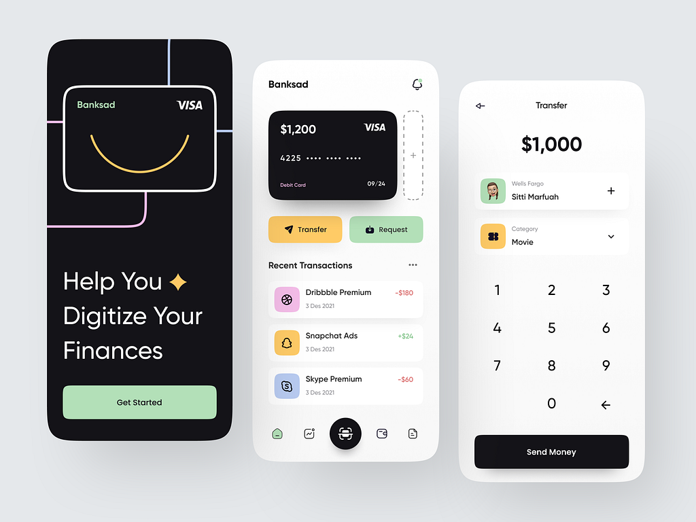
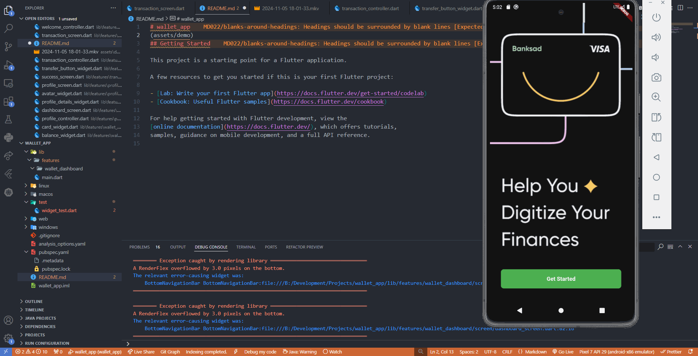

# Application Wallet Digital

---

Sebuah aplikasi dompet digital sederhana yang dibuat menggunakan Flutter. Aplikasi ini memungkinkan pengguna untuk mengelola dompet, melakukan transfer uang, dan fitur lainnya. Saat ini, aplikasi belum terintegrasi dengan database dan menggunakan data statis.

https://cdn.dribbble.com/userupload/3072219/file/original-f9f46d58891a85d226f1460d40a7557d.png?resize=752x



# Demonya :

---



## Fitur

- **Onboarding**: Layar sambutan untuk memperkenalkan aplikasi kepada pengguna baru.
- **Manajemen Dompet**: Melihat total saldo, menambahkan dompet baru, dan melihat detail dompet.
- **Transfer Uang**: Mengirim uang ke pengguna lain dengan memasukkan jumlah transfer.

## Instalasi

Pastikan Anda telah menginstal [Flutter](https://flutter.dev/docs/get-started/install) di komputer Anda.

1. **Clone repositori ini:**

   ```bash
   git clone https://github.com/dadisan/MobileProgramming-MoneyWalletMobileApp-Flutter.git
   ```

2. **Masuk ke direktori proyek:**

   ```bash
   cd MobileProgramming-MoneyWalletMobileApp-Flutter/wallet_app
   ```

3. **Instal dependensi:**

   ```bash
   flutter pub get
   ```

4. **Jalankan aplikasi:**

   ```bash
   flutter run
   ```

## Struktur Proyek

```
lib/
  core/
    global_component/
      - typography.dart
      - button_component.dart
      - progress_bar_component.dart
      - avatar_component.dart
      - network_image_loader.dart
    config/
      - main_app.dart
    utils/
      - route_utils.dart
    constants/
      - string_constants.dart
      - color_constants.dart
      - image_constants.dart

  data/
    transaction/
      model_responses/
        - transaction_response.dart
      dummy/
        - dummy_transactions.dart
    profile/
      model_responses/
        - profile_response.dart
      dummy/
        - dummy_profile.dart

  features/
    wallet_dashboard/
      screen/
        - dashboard_screen.dart
      widgets/
        - card_widget.dart
        - transaction_list_widget.dart
        - balance_widget.dart
      controller/
        - dashboard_controller.dart

    transaction_management/
      screen/
        - transaction_screen.dart
      widgets/
        - transaction_detail_widget.dart
        - transfer_button_widget.dart
      controller/
        - transaction_controller.dart

    onboarding/
      screen/
        - welcome_screen.dart
      widgets/
        - welcome_illustration_widget.dart
        - get_started_button_widget.dart
      controller/
        - welcome_controller.dart

    profile_management/
      screen/
        - profile_screen.dart
      widgets/
        - avatar_widget.dart
        - profile_details_widget.dart
      controller/
        - profile_controller.dart

    transfer_status/
      screen/
        - succes_screen.dart
```

## Getting Started

This project is a starting point for a Flutter application.

A few resources to get you started if this is your first Flutter project:

- [Lab: Write your first Flutter app](https://docs.flutter.dev/get-started/codelab)
- [Cookbook: Useful Flutter samples](https://docs.flutter.dev/cookbook)

For help getting started with Flutter development, view the
[online documentation](https://docs.flutter.dev/), which offers tutorials,
samples, guidance on mobile development, and a full API reference.
